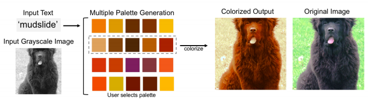
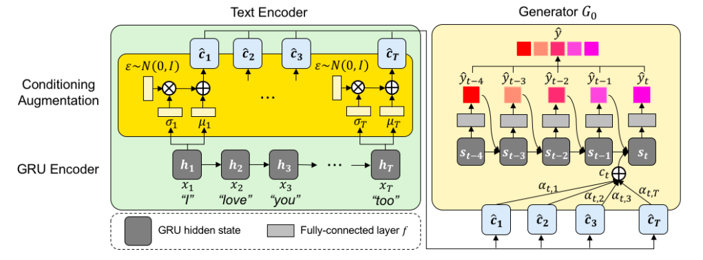
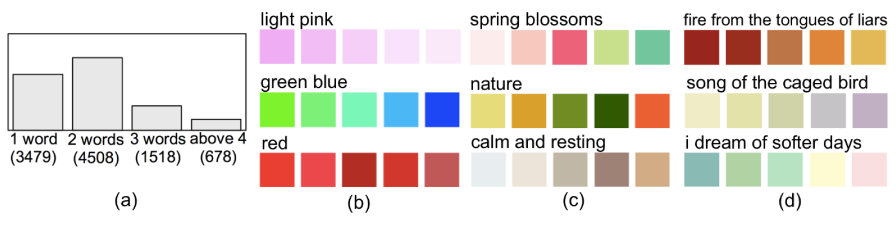

<p align="center"></p>

--------------------------------------------------------------------------------
This repository provides a PyTorch implementation of [Text2Colors](아카이브주소). Text2Colors is capable of producing plausible colors (or color palette) given variable length of text input, and colorize a grayscale image based on the colors.

<p align="center"></p>

&nbsp;

## Paper
[Text2Colors: Guiding Image Colorization through Text-Driven Palette Generation](아카이브주소) <br/>
Wonwoong Cho*<sup>1</sup>, Hyojin Bahng*<sup>1</sup>, David K. Park*<sup>1</sup>, Seungjoo Yoo*<sup>1</sup>, Ziming Wu<sup>2</sup>, Xiaojuan Ma<sup>2</sup>, and Jaegul Choo<sup>1</sup><br/>
***These authors contributed equally and are presented in random order.**<br/>

&nbsp;
&nbsp;

## Model Description
### Text-to-Palette Generation Networks (TPN) and Palette-Based Colorization Networks (PCN)
<p align="center"></p>
Overview of our Text2Colors architecture. During training, generator **G<sub>0</sub>** learns to produce a color palette (**y hat**) given a set of conditional variables (**c hat**) processed from input text. Generator **G<sub>1</sub>** learns to predict a colorized output of a grayscale image (**L**) given a palette (**p**) extracted from the ground truth image. At test time, the trained generators **G<sub>0</sub>** and **G<sub>1</sub>** are used to produce a color palette from given text, and then colorize a grayscale image reflecting the generated palette.
<p align="center"></p>

&nbsp;

## Palette-and-Text (PAT) dataset

We open our manually curated dataset named Palette-and-Text(PAT). PAT contains 10,183 text and five-color palette pairs, where the set of five colors in a palette is associated with its corresponding text description as shown in Figs. 2(b)-(d). The text description is made up of 4,312 unique words. The words vary with respect to their relationships with colors; some words are direct color words (e.g. pink, blue, etc.) while others evoke a particular set of colors (e.g. autumn or vibrant).
<p align="center"></p>
(a) the number of data items with respect to their text lengths. On the right are examples that show diverse textpalette pairs in PAT. Those text descriptions matching with their palettes include (b) direct color names, (c) texts with a relatively low level of semantic relations to colors, (d) those with a high-level semantic context. </br>

&nbsp;

**For the use of PAT dataset for your research, please cite our [paper](아카이브주소).**
```
아카이브레퍼런스
```
&nbsp;

